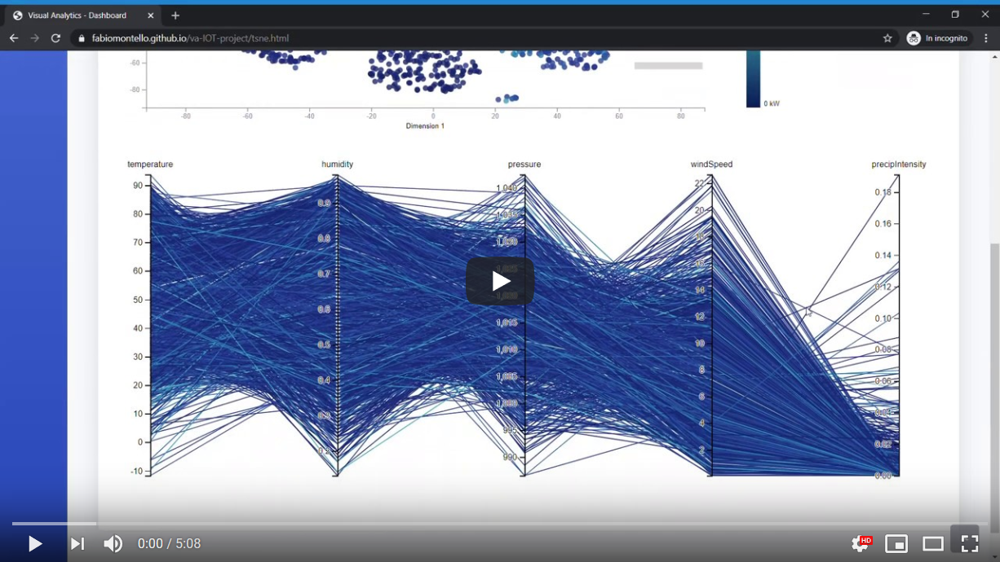
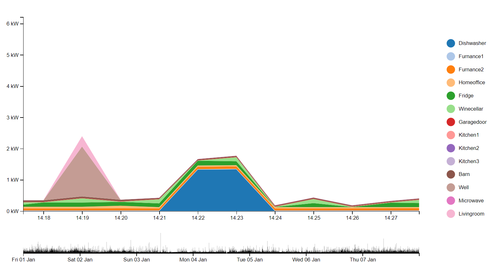
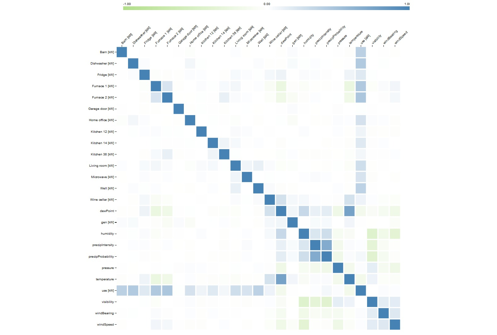
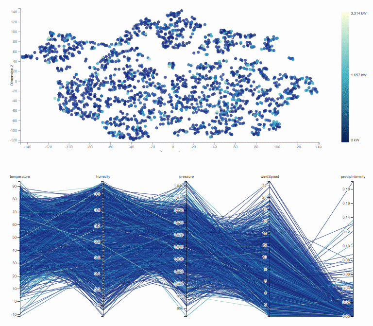
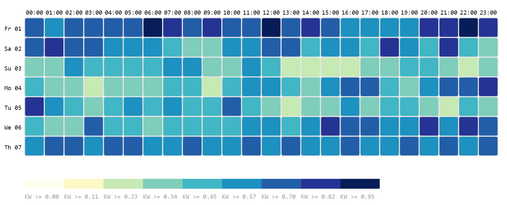
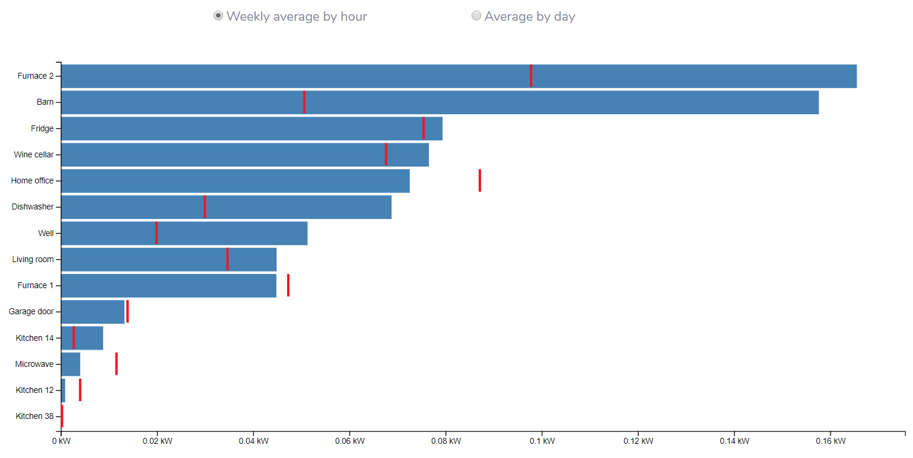
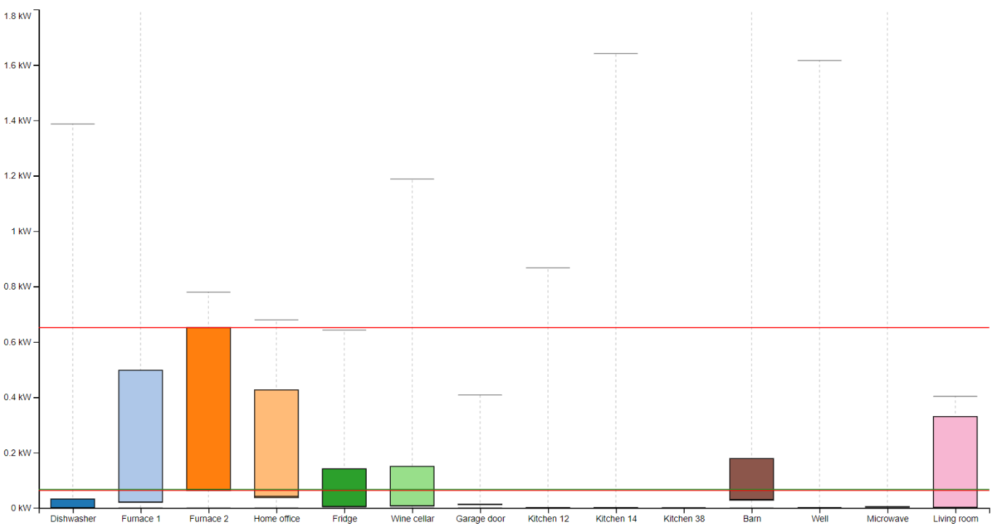
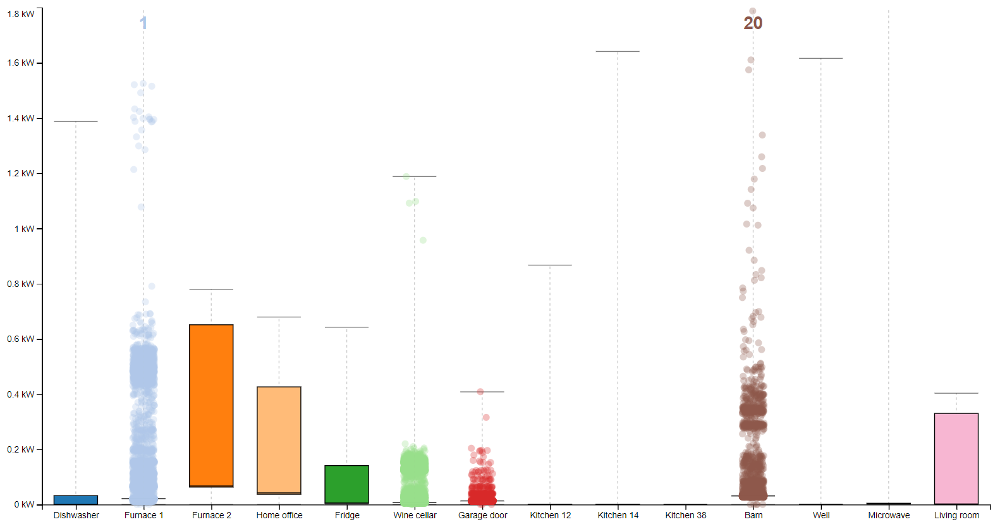
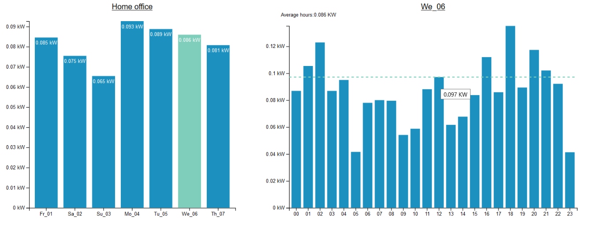

# Visual Analytics - Home Energy Monitoring
This repository contains the code and all the references for our Visual Analytics project.

<!--### Demo

-->
### Overview
Our project aims to help a common user in viewing and analyzing data related to their smart home. It contains time readings on different appliances in a house, combined with data on weather conditions. We will illustrate the graphs and techniques used to extract visual information from the data set, discussing the purpose of the methods we used and the choices we made.

### Technologies involved in the project
* [Python](https://www.st.com/en/evaluation-tools/b-l072z-lrwan1.html) 
* [Pandas](https://pandas.pydata.org/) 
* [Javascript](https://www.w3schools.com/js/) 
* [D3.js](https://d3js.org/) 
* [Bootstrap](https://getbootstrap.com/) 

### Visualizations and functionalities
The graphs used to represent the data are shown visually. More details can be obtained from the paper (based on the corresponding chapter).

### Area chart [Ch 5.1]

### Correlation matrix [Ch 5.2]

### Scatter plot and parallel coordinated [Ch 5.3]

### Heat map with bar plot and line chart [Ch 5.4]

### Box plot and bar plots [Ch 5.5]

### Team
* [Fabio Montello](https://www.linkedin.com/in/fabiomontello/) 
* [Leonardo Salvucci](https://www.linkedin.com/in/leonardo-salvucci/)  

### Useful links
Data pre-processing: https://colab.research.google.com/drive/1AJNPuR1Izu78_EHs5V93kKoAQMxOulh4  
Slide presentation: https://www.slideshare.net/LeonardoSalvucci1/home-energy-monitoring-system  
Documentation: https://drive.google.com/open?id=1vDJjxpUsyqt0kizyF87VwtZb8NFrJxrr  
URL: https://fabiomontello.github.io/va-IOT-project/  
